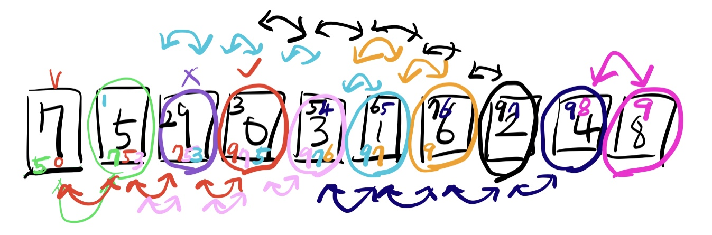
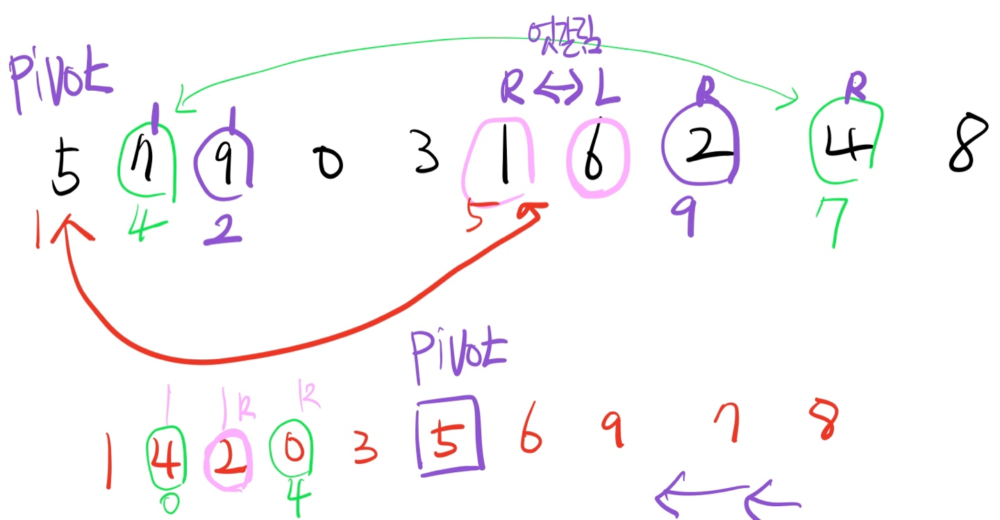
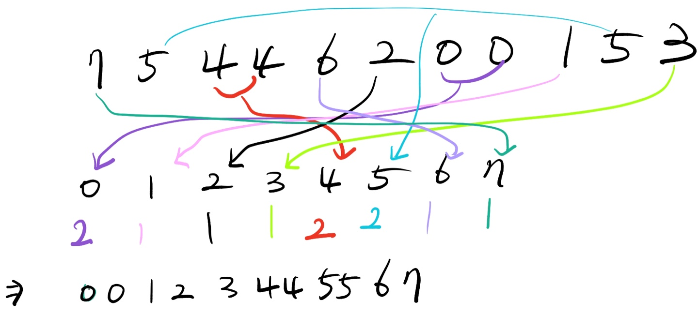

# Sort

* 정렬(sorting)이란 데이터를 특정한 기준에 따라 순서대로 나열하는 것을 말합니다.
* 일반적으로 묹제 상황에 따라서 적절한 정렬 알고리즘이 공식처럼 사용됩니다.
  
> select sort
 
* 처리되지 않은 데이터 중에서 가장 작은 데이터를 선택해 맨 앞에 있는 데이터와 바꾸는 것을 반복합니다.

&nbsp;&nbsp;&nbsp;&nbsp; 🍔 시간 복잡도 
&nbsp;&nbsp;&nbsp;&nbsp;&nbsp;&nbsp;&nbsp;&nbsp;&nbsp;&nbsp;&nbsp;&nbsp; 🌭 선택 정렬은 N번 만큼 가장 작은 수를 찾아서 맨 앞으로 보내야 합니다. 
&nbsp;&nbsp;&nbsp;&nbsp;&nbsp;&nbsp;&nbsp;&nbsp;&nbsp;&nbsp;&nbsp;&nbsp; 🍟 구현 방식에 따라서 사소한 오차는 있을 수 있지만, 전체 연산 횟수는 다음과 같다. 
&nbsp;&nbsp;&nbsp;&nbsp;&nbsp;&nbsp;&nbsp;&nbsp;&nbsp;&nbsp;&nbsp;&nbsp;&nbsp;&nbsp;&nbsp;&nbsp;&nbsp;&nbsp;&nbsp;&nbsp;&nbsp;&nbsp;&nbsp;&nbsp;  
&nbsp;&nbsp;&nbsp;&nbsp;&nbsp;&nbsp;&nbsp;&nbsp;&nbsp;&nbsp;&nbsp;&nbsp; 🍿 이는 로 표현할 수 있는데, 빅오 표기법에 따라서 이라고 작성합니다
  
> insert sort

* 처리되지 않은 데이터를 하나씩 골라 적절한 위치에 삽입합니다.
* 선택 정렬에 비해 구현 난이도가 높은 편이지만, 일반적으로 더 효율적으로 동작합니다.

&nbsp;&nbsp;&nbsp;&nbsp; 🍔 시간 복잡도 
&nbsp;&nbsp;&nbsp;&nbsp;&nbsp;&nbsp;&nbsp;&nbsp;&nbsp;&nbsp;&nbsp;&nbsp; 🌭 삽입 정렬의 시간 복잡도는 이며, 선택 정렬과 마찬가지로 반복문이 두 번 중첩되어 사용됩니다. 
&nbsp;&nbsp;&nbsp;&nbsp;&nbsp;&nbsp;&nbsp;&nbsp;&nbsp;&nbsp;&nbsp;&nbsp; 🍟 삽입 정렬은 현재 리스트의 데이터가 거의 정렬되어 있는 상태라면 매우 빠르게 동작합니다. 
&nbsp;&nbsp;&nbsp;&nbsp;&nbsp;&nbsp;&nbsp;&nbsp;&nbsp;&nbsp;&nbsp;&nbsp;&nbsp;&nbsp;&nbsp;&nbsp;&nbsp;&nbsp;&nbsp;&nbsp;&nbsp;&nbsp;&nbsp;&nbsp; 👉 최선의 경우 의 시간 복잡도를 가집니다. 
&nbsp;&nbsp;&nbsp;&nbsp;&nbsp;&nbsp;&nbsp;&nbsp;&nbsp;&nbsp;&nbsp;&nbsp;&nbsp;&nbsp;&nbsp;&nbsp;&nbsp;&nbsp;&nbsp;&nbsp;&nbsp;&nbsp;&nbsp;&nbsp; 👉 이미 정렬되어 있는 상태에서 다시 삽입 정렬을 수행하면 
&nbsp;&nbsp;&nbsp;&nbsp;&nbsp;&nbsp;&nbsp;&nbsp;&nbsp;&nbsp;&nbsp;&nbsp; 🍿 이는 로 표현할 수 있는데, 빅오 표기법에 따라서 이라고 작성합니다
  
> quick sort

* 기준 데이터를 설정하고 그 기준보다 큰 데이터와 작은 데이터의 위치를 바꾸는 방법입니다.
* 일반적인 상황에서 가장 많이 사용되는 정렬 알고리즘 중 하나입니다.
* 병합 정렬과 더불어 대부분의 프로그래밍 언어의 정렬 라이브러리의 근간이 되는 알고리즘입니다.
* 가장 기본적인 퀵 정렬은 첫 번째 데이터를 기준 데이터(Pivot)로 설정합니다.

&nbsp;&nbsp;&nbsp;&nbsp; 🍔 시간 복잡도 
&nbsp;&nbsp;&nbsp;&nbsp;&nbsp;&nbsp;&nbsp;&nbsp;&nbsp;&nbsp;&nbsp;&nbsp; 🌭 퀵 정렬은 평균의 경우의 시간 복잡도를 가집니다. 
&nbsp;&nbsp;&nbsp;&nbsp;&nbsp;&nbsp;&nbsp;&nbsp;&nbsp;&nbsp;&nbsp;&nbsp; 🍟 하지만 최악의 경우 의 시간 복잡도를 가집니다. 
&nbsp;&nbsp;&nbsp;&nbsp;&nbsp;&nbsp;&nbsp;&nbsp;&nbsp;&nbsp;&nbsp;&nbsp;&nbsp;&nbsp;&nbsp;&nbsp;&nbsp;&nbsp;&nbsp;&nbsp;&nbsp;&nbsp;&nbsp;&nbsp; 👉 첫 번째 원소를 피벗으로 삼을 때, 이미 정렬된 배열에 대해서 퀵 정렬을 수행하면 어떻게 될까요?

> Counting sort (계수 정렬)

* 특정한 조건이 부합할 때만 사용할 수 있지만 매우 빠르게 동작하는 정렬 알고리즘입니다. 
&nbsp;&nbsp;&nbsp;&nbsp; 👉 계수 정렬은 데이터의 크기 범위가 제한되어 정수 형태로 표현할 수 있을 때 사용 가능합니다.
* 데이터의 개수가 N, 데이터(양수) 중 최대값이 K일 때 최악의 경우에도 수행 시간 를 보장합니다.

