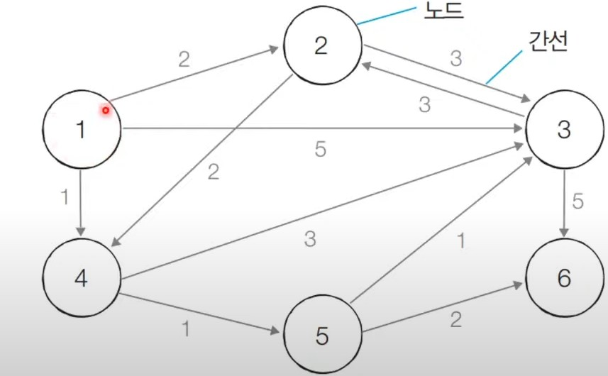

# 최단 경로 알고리즘

* 최단 경로 알고리즘은 가장 짧은 경로를 찾는 알고리즘을 의미한다.
* 다양한 문제 상황  
&nbsp;&nbsp;&nbsp;&nbsp; 👉 한 지점에서 다른 한 지점까지의 최단 경로  
&nbsp;&nbsp;&nbsp;&nbsp; 👉 한 지점에서 다른 모든 지점까지의 최단 경로 
&nbsp;&nbsp;&nbsp;&nbsp; 👉 모든 지점에서 다른 모든 지점 까지의 최단경로 
* 각 지점은 그래프에서 노드로 표현
* 지점간 연결된 도로는 그래프에서 간선으로 표현

> Dijkstra Algorithm
* 특정한 노드에서 출발하여 다른 모든 노드로 가는 최단 경로를 계산합니다.
* 다익스트라 최단 경로 알고리즘은 음의 간선이 없을 때 정상적으로 작동합니다. 
&nbsp;&nbsp;&nbsp;&nbsp; 👉 현실 세계의 도로는 음의 간선으로 표현되지 않습니다.
* 다익스트라 최단 경로 알고리즘은 그리디 알고리즘으로 분류됩니다.
&nbsp;&nbsp;&nbsp;&nbsp; 👉 매 상황에서 가장 비용이 적은 노드를 선택해 임의의 과정을 반복합니다.

### operation
&nbsp;&nbsp;&nbsp;&nbsp; 1️⃣ 출발 노드를 설정합니다. 
&nbsp;&nbsp;&nbsp;&nbsp; 2️⃣ 최단 거리 테이블을 초기화합니다. 
&nbsp;&nbsp;&nbsp;&nbsp; 3️⃣ 방문하지 않은 노드 중에서 최단 거리가 가장 짧은 노드를 선택합니다. 
&nbsp;&nbsp;&nbsp;&nbsp; 4️⃣ 해당 노드를 거쳐 다른 노드로 가는 비용을 계산하여 최단 거리 테이블을 갱신합니다. 
&nbsp;&nbsp;&nbsp;&nbsp; 5️⃣ 위 과정에서 3번과 4번을 반복합니다.
