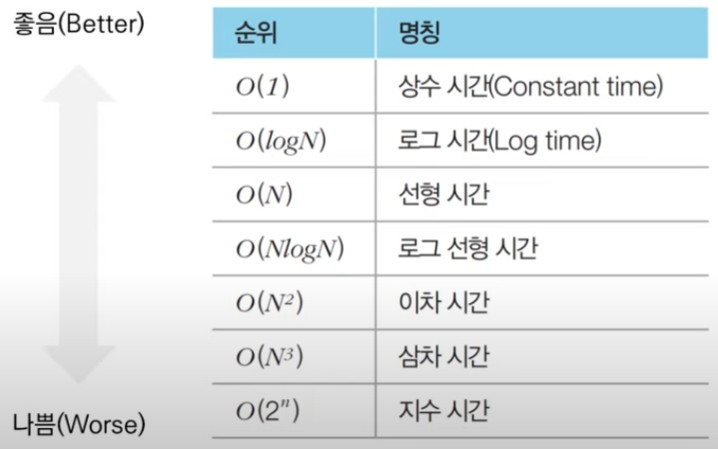

# lecture_1 basic algorithm

> 복잡도 (Complexity)

* 시간 복잡도 : 특정한 크기의 입력에 대하여 알고리즘의 수행 시간 분석
* 공간 복잡도 : 특정한 크기의 입력에 대하여 알고리즘의 메모리 사용량 분석

> 빅오 표기법 ( Big-O Notation )  

* 가장 빠르게 증가하는 항만을 고려하는 표기법입니다.

