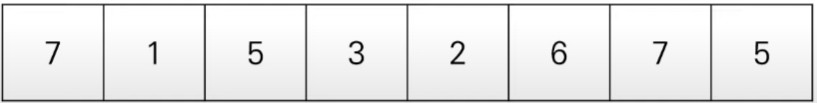

# List

> List Data Type

* 여러 개의 데이터를 연속적으로 담아 처리하기 위해 사용하는 자료형입니다.<br>
&nbsp;&nbsp;&nbsp;&nbsp; 🧷 사용자 입장에서 C나 자바에서의 배열(Array)의 기능 및 연결 리스트와 유사한 기능을 지원합니다.<br>
&nbsp;&nbsp;&nbsp;&nbsp; 🎈 C++의 STL vector와 기능적으로 유사합니다<br>
&nbsp;&nbsp;&nbsp;&nbsp; 💻 리스트 대신에 벼열 혹은 테이블이라 부르기도 합니다.<br>



> List initialize

* 리스트는 대괄호([])안에 원소를 넣어 초기화하며, 쉼표(,)로 원소를 구분합니다.
* 비어 있는 리스트를 선언하고자 할 때는 list() 혹은 간단히 []를 이용할 수 있습니다.
* 리스트의 원소에 접근할 때는 인덱스(Index) 값을 괄호에 넣습니다.<br>
&nbsp;&nbsp;&nbsp;&nbsp; 🧷 인덱스는 0부터 시작합니다.

```python
# 직접 데이터를 넣어 초기화
a = [1, 2, 3, 4, 5, 6, 7, 8, 9]
print(a)

# 네 번째 원소만 출력
print(a[3])

# 크기가 N이고, 모든 값이 0인 1차원 리스트 초기화
n = 10
a = [0] * n
print(a)

# 실행결과
# [1, 2, 3, 4, 5, 6, 7, 8, 9]
# 4
# [0, 0, 0, 0, 0, 0, 0, 0, 0, 0]
```
> list index and slicing

* 인덱스 값을 입력하여 리스트의 특정한 원소에 접근하는 것을 인덱싱(Indexing)이라고 합니다.<br>
&nbsp;&nbsp;&nbsp;&nbsp; 🧷 파이썬의 인덱스 값은 양의 정수와 음의 정수를 모두 사용할 수 있습니다.<br>
&nbsp;&nbsp;&nbsp;&nbsp; 🎈 음의 정수를 넣으면 원소를 거꾸로 탐색하게 됩니다.<br>

```python
a = [1, 2, 3, 4, 5, 6, 7, 8, 9]

#여덟 번째 원소만 출력
print(a[7])

#뒤에서 첫 번째 원소 출력
print(a[-1])

#뒤에서 세 번째 원소 출력
print(a[-3])

#네 번재 원소 값 변경
a[3] = 7
print(a)

# 실행결과
# 8
# 9
# 7
# [1, 2, 3, 7, 5, 6, 7, 8, 9]
```

* 리스트에서 연속적인 위치를 갖는 원소들을 가져와야 할 때는 <strong>슬라이싱(Slicing)</strong>을 이용합니다.<br>
&nbsp;&nbsp;&nbsp;&nbsp; 🧷 대괄호 안에 콜론(:)을 넣어서 시작 인덱스와 끝 인덱스를 설정할 수 있습니다. <br>
&nbsp;&nbsp;&nbsp;&nbsp; 🎈 끝 인덱스는 실제 인덱스보다 1을 더 크게 설정합니다.<br>

```python
a = [1, 2, 3, 4, 5, 6, 7, 8, 9]

# 네 번째 원소만 출력
print(a[3])

# 두 번째 원소부터 네 번째 원소까지
print(a[1 : 4])

# 실행 결과
# 4
# [2, 3, 4]
```

> List Comprehension

* 리스트를 초기화하는 방법 중 하나 입니다.<br>
&nbsp;&nbsp;&nbsp;&nbsp; 🧷 대괄호 안에 조건문과 반복문을 적용하여 리스트를 초기화 할 수 있습니다.

```python
# 0부터 9까지 수를 포함하는 리스트
array = [i for i in range(10)]
print(array)

# 실행 결과
# [0, 1, 2, 3, 4, 5, 6, 7, 8, 9]

# 0부터 19까지의 수 중에서 홀수만 포함하는 리스트
array = [i for i in range(20) if i % 2 == 1]
print(array)

# 1부터 9까지의 수들의 제곱 값을 포함하는 리스트
array = [i**2 for i in range(1, 10)]
print(array)

# 실행 결과
# [1, 3, 5, 7, 9, 11, 13, 15, 17, 19]
# [1, 4, 9, 16, 25, 36, 49, 64, 81]
```

* 리스트 컴프리헨션은 <strong> 2차원 리스트를 초기화할 때 효과적으로 사용</strong>될 수 있습니다.
* 특히 N X M 크기의 2차원 리스트를 한 번에 초기화 해야 할 때 매우 유용합니다.<br>
```python
# deep copy 
# array[0] 과 array[1]의 id가 다름
# array[0][0]의 값을 바꿔도 array[1][0]의 값은 변하지 않음
array = [[0] * 3 for _ in range(5)] 
array[0][0] = 11
print(array[0][0])
print(array[1][0])

# 실행 결과
# 11
# 0
```
* 만약 2차원 리스트를 초기화할 때 다음과 같이 작성하면 예기치 않은 결과가 나올 수 있습니다.<br>
&nbsp;&nbsp;&nbsp;&nbsp; 🎈 위 코드는 전체 리스트 안에 포함된 각 리스트가 모두 같은 객체로 인식됨.

```python
# shallow copy 
# array[0] 과 array[1]의 id가 같음
# array[0][0]의 값을 바꾸면 array[1][0]의 값도 변함
array = [[0] * 3] * 5
array[0][0] = 11
print(array[0][0])
print(array[1][0])

# 실행 결과
# 11
# 11
```

* 파이썬은 반복을 수행하되 반복을 위한 변수의 값을 무시하고자 할 때 언더바(_)를 자주 사용합니다.

> list internal method

* append()<br>
&nbsp;&nbsp;&nbsp;&nbsp; 🧩 사용법 : 변수명.append() <br>
&nbsp;&nbsp;&nbsp;&nbsp; 🎲 설명 : 리스트에 원소를 하나 삽입할 때 사용한다.<br>
&nbsp;&nbsp;&nbsp;&nbsp; 🏓 시간 복잡도 : <br>
```python
a = []
a.append(1)
print(a)
# 실행 결과
# [1]
```
* sort()<br>
&nbsp;&nbsp;&nbsp;&nbsp; 🧩 사용법 : 변수명.sort() | 변수명.sort(reverse = True) <br>
&nbsp;&nbsp;&nbsp;&nbsp; 🎲 설명 : 기본 정렬 기능으로 오름차순으로 정렬한다. reverse옵션이 True인 경우 내림차순 <br>
&nbsp;&nbsp;&nbsp;&nbsp; 🏓 시간 복잡도 : <br>
```python
a = [3,5,1,6,3,7]
a.sort()
print(a)
# 실행 결과
# [1, 3, 3, 5, 6, 7]
```
* reverse()<br>
&nbsp;&nbsp;&nbsp;&nbsp; 🧩 사용법 : 변수명.reverse() <br>
&nbsp;&nbsp;&nbsp;&nbsp; 🎲 설명 : 리스트의 원소의 순서를 모두 뒤집어 놓는다. <br>
&nbsp;&nbsp;&nbsp;&nbsp; 🏓 시간 복잡도 : <br>

```python
a = [5, 3, 1, 2, 4]
a.reverse()
print(a)
# 실행 결과
# [4, 2, 1, 3, 5]
```

* insert()<br>
&nbsp;&nbsp;&nbsp;&nbsp; 🧩 사용법 : 변수명.insert(삽입할 위치, 삽입할 값) <br>
&nbsp;&nbsp;&nbsp;&nbsp; 🎲 설명 : 특정한 인덱스 위치에 원소를 삽입할 때 사용한다. <br>
&nbsp;&nbsp;&nbsp;&nbsp; 🏓 시간 복잡도 : <br>
```python
a = [1,2,3]
a.insert(0, 100)
print(a)

# 실행 결과
# [100, 1, 2, 3]
```
* count()<br>
&nbsp;&nbsp;&nbsp;&nbsp; 🧩 사용법 : 변수명.count(셀 값) <br>
&nbsp;&nbsp;&nbsp;&nbsp; 🎲 설명 :  리스트에서 특정한 값을 가지는 데이터의 개수를 셀 때 사용한다.<br>
&nbsp;&nbsp;&nbsp;&nbsp; 🏓 시간 복잡도 : <br>
```python
a = [1,2,3,3,3,3,1,1,1,12,2,2,2,3]
print(a.count(1))

# 실행 결과
# 4
```
* remove()<br>
&nbsp;&nbsp;&nbsp;&nbsp; 🧩 사용법 : 변수명.remove(지울 값) <br>
&nbsp;&nbsp;&nbsp;&nbsp; 🎲 설명 :  특정한 값을 갖는 원소를 제거하는데, 값을 가진 원소가 여러 개면 하나만 제거한다.<br>
&nbsp;&nbsp;&nbsp;&nbsp; 🏓 시간 복잡도 : <br>
```python
a = [1,2,3,3,3,3,1,1,1,12,2,2,2,3]
a.remove(1)
print(a)

# 실행 결과
# [2, 3, 3, 3, 3, 1, 1, 1, 12, 2, 2, 2, 3]
```
