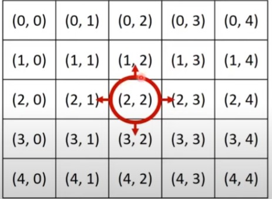

# 구현

* 시뮬레이션 및 완전 탐색 문제에서는 2차원 공간에서의 방향 벡터가 자주 활용 됩니다.



```python
# 동, 북, 서, 남
dx = [0, -1, 0, 1]
dy = [1, 0, -1, 0]

# 현재 위치
x, y = 2, 2

for i in range(4):
    #다음 위치
    nx = x + dx[i]
    ny = y + dx[i]
    print(nx, ny)
    
# 실행 결과
# 2 2
# 1 1
# 2 2
# 3 3
```


