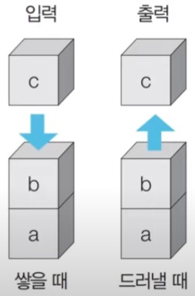
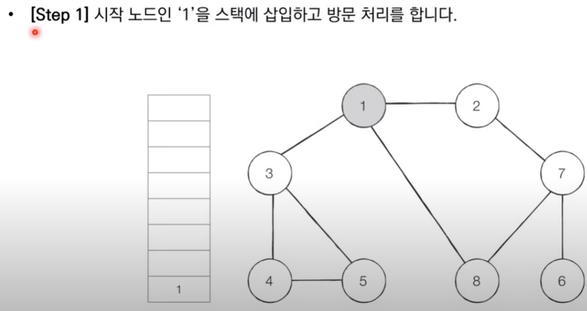
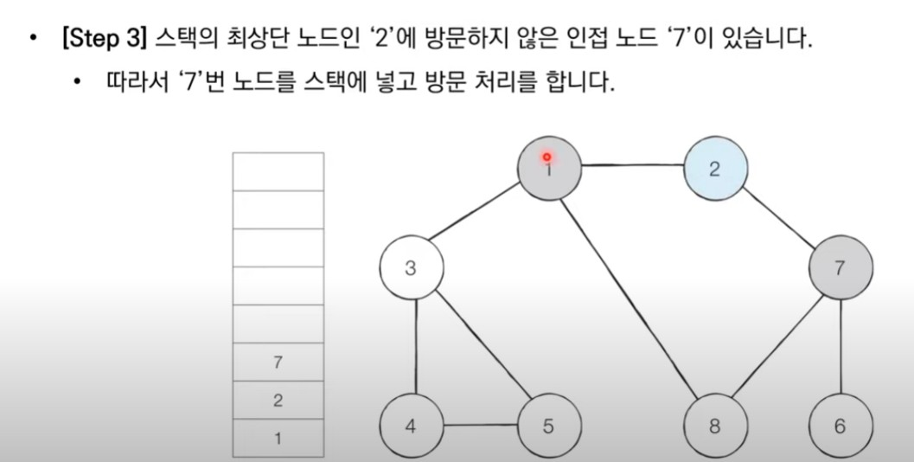
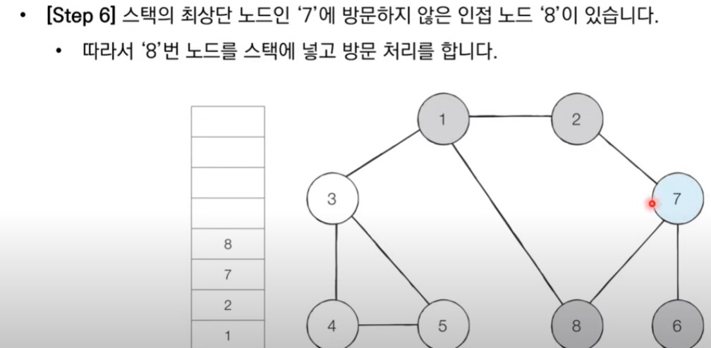
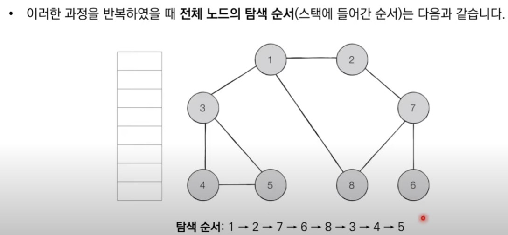
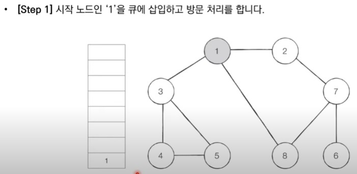
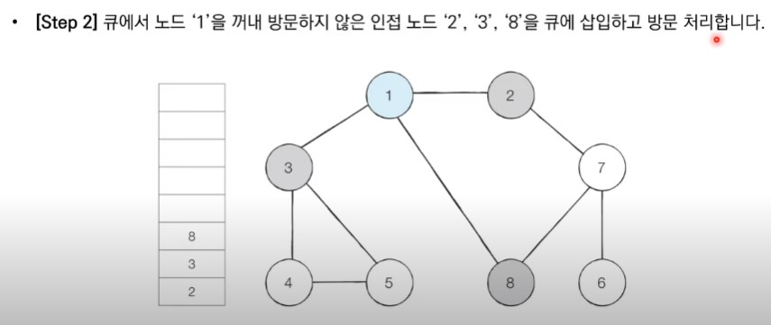
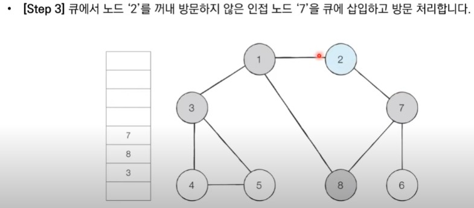
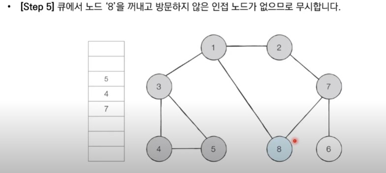

# DFS & BFS

> Stack

* 먼저 들어 온 데이터가 나중에 나가는 형식(LIFO)의 자료구조입니다.
* 입구와 출구가 동일한 형태로 스택을 시각화할 수 있습니다.



삽입(5) - 삽입(2) - 삽입(3) - 삽입(7) - 삭제() - 삽입(1) - 삽입(4) - 삭제()

\============================================<br>
\|  5️⃣(1) 2️⃣(2) 3️⃣(3) 7️⃣(4)(5 => d) 1️⃣(6) 4️⃣(7)(8 => d)<br>
\============================================

```python

stack = []

#삽입(5) - 삽입(2) - 삽입(3) - 삽입(7) - 삭제() - 삽입(1) - 삽입(4) - 삭제()
stack.append(5)
stack.append(2)
stack.append(3)
stack.append(7)
stack.pop()
stack.append(1)
stack.append(4)
stack.append(4)

print(stack[::-1])
print(stack)

```

> Queue

* 먼저 들어 온 데이터가 먼저 나가는 형식(FIFO)의 자료구조입니다.
* 큐는 입구와 출구가 모두 뚫려 있는 터널과 같은 형태로 시각화 할 수 있습니다.

#삽입(5) - 삽입(2) - 삽입(3) - 삽입(7) - 삭제() - 삽입(1) - 삽입(4) - 삭제()

\============================================<br>
\|  5️⃣(1)(5 => d) 2️⃣(2)(8 => d) 3️⃣(3) 7️⃣(4) 1️⃣(6) 4️⃣(7)<br>
\============================================

```python
from collections import deque
 
 # 큐 구현을 위해 deque 라이브러리 사용
 queue = deque()
 
 queue.append(5)
 queue.append(2)
 queue.append(3)
 queue.append(7)
 queue.popleft()
 queue.append(1)
 queue.append(4)
 queue.popleft()
 
 print(queue)
 queue.reverse()
 print(queue)
 
```

> recursive function

* 재귀 함수란 자기 자신을 다시 호출하는 함수를 의미합니다.
* 단순한 형태의 재귀 함수 예제<br>
&nbsp;&nbsp;&nbsp;&nbsp; 🛒 '재귀 함수를 호출합니다.'라는 문자열을 무한히 출력합니다.<br>
&nbsp;&nbsp;&nbsp;&nbsp; 🎐 어느 정도 출력하다가 최대 재귀 깊이 초과 메시지가 출력됩니다.

```python

def recursive_function():
    print('재귀 함수를 호출합니다.')
    recursive_function()
    
# 출력 결과
# 재귀 함수를 호출합니다.
# 재귀 함수를 호출합니다.
# 재귀 함수를 호출합니다.
# ...........
# Error => RecursiveError

```

> 유클리드 호제법

* 최대공약수 계산<br>
&nbsp;&nbsp;&nbsp;&nbsp; 🛒 두 자연수 A, B에 대하여 (A > B) A를 B로 나눈 나머지를 R이라고 합시다.<br>
&nbsp;&nbsp;&nbsp;&nbsp; 🧤 이 때 A와 B의 최대공약수는 B와 R의 최대공약수와 같습니다.

* 유클리드 호제법의 아이디어를 그대로 재귀 함수로 작성할 수 있습니다.

> 재귀 함수 사용의 유의사항

* 재귀 함수를 잘 활용하면 복잡한 알고리즘을 간결하게 작성할 수 있습니다.<br>
&nbsp;&nbsp;&nbsp;&nbsp; 🤜 단, 오히려 다른 사람이 이해하기 어려운 형태의 코드가 될 수도 있으므로 신중하게 사용해야 합니다.
* 모든 재귀 함수는 반복문을 이용하여 동일한 기능을 구현할 수 있습니다.
* 재귀 함수가 반복문보다 유리한 경우도 있고 불리한 경우도 있습니다.
* 컴퓨터가 함수를 연속적으로 호출하면 컴퓨터 메모리 내부의 스택 프레임에 쌓입니다.<br>
&nbsp;&nbsp;&nbsp;&nbsp; 🤜 그래서 스택을 사용해야 할 때 구현상 스택 라이브러리 대신에 재귀 함수를 이용하는 경우가 많습니다.


> DFS (Depth-First Search)

* DFS는 깊이 우선 탐색이라고도 부르며 그래프에서 깊은 부분을 우선적으로 탐색하는 알고리즘입니다.
* DFS는 스택 자료구조(혹은 재귀 함수)를 이용하며, 구체적인 동작 과정은 다음과 같습니다.<br>
&nbsp;&nbsp;&nbsp;&nbsp; 1️⃣ 탐색 시작 노드를 스택에 삽입하고 방문 처리를 합니다.<br>
&nbsp;&nbsp;&nbsp;&nbsp; 2️⃣ 스택의 최상단 노드에 방문하지 않은 인접한 노드가 하나라도 있으면 그 노드를 스택에 넣고 방문 처리합니다. <br>
&nbsp;&nbsp;&nbsp;&nbsp;&nbsp;&nbsp;&nbsp;&nbsp;&nbsp;&nbsp;&nbsp;방문하지 않은 인접 노드가 없으면 스택에서 최상단 노드를 꺼냅니다.<br>
&nbsp;&nbsp;&nbsp;&nbsp; 3️⃣ 더 이상 2번의 과정을 수행할 수 없을 때까지 반복합니다.

   
   

```python
def dfs(graph, isvisited, n):
    isvisited[n] = True
    print("{} -> ".format(n), end='')
    for i in graph[n]:
          if not isvisited[i]:
              dfs(graph, isvisited, i)
    


graph = [
  [],
  [2, 3, 8],
  [1, 7],
  [1, 4, 5],
  [3, 5],
  [3, 4],
  [7],
  [2, 6, 8],
  [1, 7]
]

isvisited = [False] * 9

dfs(graph, isvisited, 1)

# 실행 결과 
# 1 -> 2 -> 7 -> 6 -> 8 -> 3 -> 4 -> 5 ->
```

```c++
#include <bits/stdc++.h>
#include <iostream>

using namespace std;

bool isvisited[9];
vector<int> graph[9];

void dfs(int x) {
  isvisited[x] = true;
  cout << x << ' ';
  for(int i = 0; i <graph[i].size(); i++){
    int y = graph[x][y];
    if(!isvisited[y]) dfs(y);
  }
}

int main() {

  graph[1].push_back(2);
  graph[1].push_back(3);
  graph[1].push_back(8);

    // 노드 2에 연결된 노드 정보 저장 
  graph[2].push_back(1);
  graph[2].push_back(7);
    
    // 노드 3에 연결된 노드 정보 저장 
  graph[3].push_back(1);
  graph[3].push_back(4);
  graph[3].push_back(5);
   
    // 노드 4에 연결된 노드 정보 저장 
  graph[4].push_back(3);
  graph[4].push_back(5);
    
    // 노드 5에 연결된 노드 정보 저장 
  graph[5].push_back(3);
  graph[5].push_back(4);
    
    // 노드 6에 연결된 노드 정보 저장 
  graph[6].push_back(7);
    
    // 노드 7에 연결된 노드 정보 저장 
  graph[7].push_back(2);
  graph[7].push_back(6);
  graph[7].push_back(8);
    
    // 노드 8에 연결된 노드 정보 저장 
  graph[8].push_back(1);
  graph[8].push_back(7);
    
   dfs(1);


}
```

> BFS (Breadth-First Search)

* BFS는 너비 우선 탐색이라고도 부르며, 그래프에서 가까운 노드부터 우선적으로 탐색하는 알고리즘입니다.
* BFS는 큐 자료구조를 이용하며, 구체적인 동작 과정은 다음과 같습니다
* &nbsp;&nbsp;&nbsp;&nbsp; 1️⃣ 탐색 시작 노드를 큐에 삽입하고 방문 처리를 합니다.<br>
&nbsp;&nbsp;&nbsp;&nbsp; 2️⃣ 큐에서 노드를 꺼낸 뒤에 해당 노드의 인접 노드 중에서 방문하지 않은 노드를 모두 큐에 삽입하고 방문 처리합니다.<br>
&nbsp;&nbsp;&nbsp;&nbsp; 3️⃣ 더 이상 2번의 과정을 수행할 수 없을 때까지 반복합니다.

   
 

```python
from collections import deque

def bfs(graph, isvisited, n):
    queue = deque([n])
    isvisited[n] = True
    while len(queue) != 0:
        a = queue.popleft()
        print(str(a) + ' ', end='')
        for i in graph[a]:
            if not isvisited[i]:
                isvisited[i] = True
                queue.append(i)

graph = [
  [],
  [2, 3, 8],
  [1, 7],
  [1, 4, 5],
  [3, 5],
  [3, 4],
  [7],
  [2, 6, 8],
  [1, 7]
]

isvisited = [False] * 9

bfs(graph, isvisited, 1)

# 실행 결과
# 1 2 3 8 7 4 5 6
```
```c++

#include <bits/stdc++.h>

using namespace std;

bool visited[9];
vector<int> graph[9];

void bfs(int start){
  queue<int> q;
  q.push(start);
  visited[start] = true;
  while(!q.empty()){
    int x = q.front();
    q.pop();
    cout << x << ' ';
    for(int i = 0;i < graph[x].size(); i++){
      int y = graph[x][i];
      if(!visited[y]){
        q.push(y);
        visited[y] = true;        
      }
    }
  }
}
int main(void) {
  graph[1].push_back(2);
  graph[1].push_back(3);
  graph[1].push_back(8);

    // 노드 2에 연결된 노드 정보 저장 
  graph[2].push_back(1);
  graph[2].push_back(7);
    
    // 노드 3에 연결된 노드 정보 저장 
  graph[3].push_back(1);
  graph[3].push_back(4);
  graph[3].push_back(5);
   
    // 노드 4에 연결된 노드 정보 저장 
  graph[4].push_back(3);
  graph[4].push_back(5);
    
    // 노드 5에 연결된 노드 정보 저장 
  graph[5].push_back(3);
  graph[5].push_back(4);
    
    // 노드 6에 연결된 노드 정보 저장 
  graph[6].push_back(7);
    
    // 노드 7에 연결된 노드 정보 저장 
  graph[7].push_back(2);
  graph[7].push_back(6);
  graph[7].push_back(8);
    
    // 노드 8에 연결된 노드 정보 저장 
  graph[8].push_back(1);
  graph[8].push_back(7);
    
  bfs(1);
  return 0;
}
```
